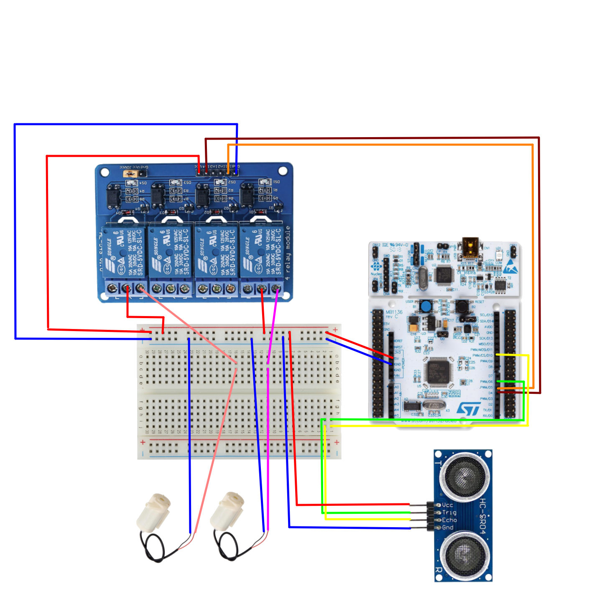

# Water Tank

Controlling a toy water tank's level using an ultrasound sensor and two pumps, and changing the set point from an Android device via BLE.

## Hardware Requirements
- STM32F401 Nucleo-64 (or Arduino Uno 3)
- BLE expansion board (only for the STM)
- An Android Device (>= 5.0/Marshmallow)
- A 4 Channel Solid State Relay (optocoupler)
- An Ultrasound Sensor (HC-SR04)
- Two 5V DC water pumps.

## Build Requirements
- Mbed Studio (or Arduino IDE or VSCode Arduino extension)
- Android Studio
  
## Circuit Diagram

<a href="https://www.flaticon.com/free-icons/water-tank" title="water tank icons">Water tank icons created by Circlon Tech - Flaticon</a>
