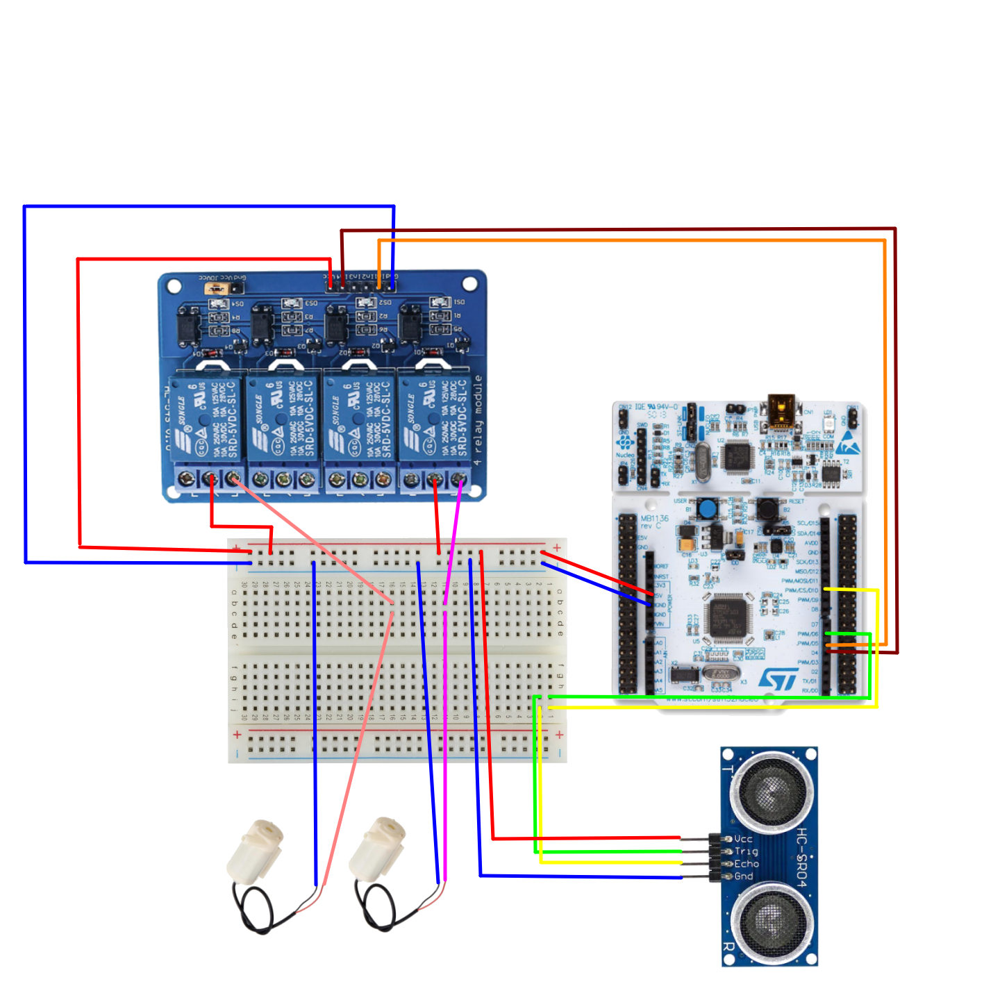

# Water Tank

Controlling a toy water tank's level using an ultrasound sensor and two pumps, and changing the set point from an Android device via BLE.


One water tank's height was controlled, the other tank acted as a reservoir. 

Note that the experiment was repeated with bigger tanks (not shown above), the reason for choosing bigger tanks was: that the pumps were pretty fast (1.6 L/min), so much so, that one of them would drain up the tank it was put in long before it could be switched off by the system, triggering the other to pump water back, and going on like that in a loop...

## Hardware Requirements
- STM32F401 Nucleo-64 (or Arduino Uno 3)
- BLE expansion board (only for the STM)
- An Android Device (>= 5.0/Marshmallow)
- A 4 Channel Solid State Relay (optocoupler)
- An Ultrasound Sensor (HC-SR04)
- Two 5V DC water pumps.

## Build Requirements
- Mbed Studio (or Arduino IDE or VSCode Arduino extension)
- Android Studio
  
## Circuit Diagram


## Control Algorithm

A very simple on/off-like control algorithm with 3 states (all pumps off, first on, second on) was used to control the water level of the water tank. This is the core of it written for Arduino:

```cpp
if (abs(error) < THRESH){
    digitalWrite(INNER_PUMP, LOW);
    digitalWrite(OUTER_PUMP, LOW);
}else if (error > 0){
    digitalWrite(INNER_PUMP, HIGH);
    digitalWrite(OUTER_PUMP, LOW);
}else{
    digitalWrite(INNER_PUMP, LOW);
    digitalWrite(OUTER_PUMP, HIGH);
}
```

## Sources

### Mbed OS BLE Code:
https://github.com/ARMmbed/mbed-os-example-ble

### Android BLE Code:
https://github.com/PunchThrough/ble-starter-android

### Water Tank Icon (by Circlon Tech):
https://www.flaticon.com/free-icons/water-tank

### App to Test BLE (nRF Connect):
https://play.google.com/store/apps/details?id=no.nordicsemi.android.mcp&hl=it
